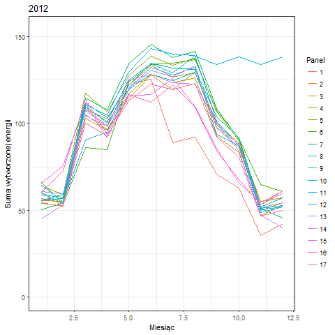

## Spis treści
1. [Wstęp](#wstep)
2. [Wykorzystane biblioteki](#wykorzystane-biblioteki)
3. [Przygotowanie danych](#przygotowanie-danych)
4. [Zbiór danych](#zbior-danych)
5. [Korelacja między zmiennymi](#korelacja-miedzy-zmiennymi)
6. [Animacja pokazująca różnicę w wytwarzanej energii w 2012 i 2013 roku](#animacja-pokazujaca-roznice-w-wytwarzanej-energii-w-2012-i-2013-roku)
7. [Regresor przewidujący wytwarzaną energię](#regresor-przewidujacy-wytwarzana-energie)
8. [Analiza ważności atrybutów najlepszego modelu regresji](#analiza-waznosci-atrybutow-najlepszego-modelu-regresji)

## Wstęp
Raport został stworzony w celu analizy danych z czujników paneli fotowoltaicznych, co doprowadziło do określenia jakie czynniki najlepiej pozwalają przewidzieć energię wytwarzaną w przyszłości. Największą trudność stanowiło uzupełnienie błędnych wartości pomiarów czujników. Aby tworzenie modelu regresji przebiegło pomyślnie należało jak najlepiej uzupełnić nieprawidłowe dane związane z nasłonecznieniem i wytwarzaną energią, bo to własnie nasłonecznienie najbardziej wpływa na wartość wytworzonej energii.

Aby zapewnić powtarzalność wyników przy każdym generowaniu raportu należało wykonać poniższy fragment kodu:
```{r wstep}
set.seed(23)
```

## Wykorzystane biblioteki
```{r wykorzystane-biblioteki, message=FALSE, warning=FALSE}
library(knitr)        # generowanie raportu
library(dplyr)        # przetwarzanie danych jak w SQL
library(lubridate)    # ułatwienie pracy z datami
library(reshape2)     # udostępnia funkcje melt i cast do przetwarzania danych
library(corrplot)     # wizualizacja korelacji między zmiennymi
library(ggplot2)      # tworzenie wykresów
library(gganimate)    # tworzenie animacji na wykresach
library(directlabels) # dodanie etykiet do linii na wykresach
library(caret)        # klasyfikacja i regresja
```

## Przygotowanie danych

### Wczytanie danych
```{r przygotowanie-danych, cache=TRUE}
sciezka_do_pliku = paste(getwd(), "elektrownie.csv", sep = "/") # wczytanie ścieżki do pliku z danymi
dane <- read.csv(file = sciezka_do_pliku, row.names=1)          # wczytanie zbioru danych
dane$data <- as.POSIXct(strptime(dane$data, "%m/%d/%Y %k:%M"))  # konwersja daty do odpowiedniego formatu
```

### Nadpisywanie błędnych wartości
Przy wstępnej analizie danych największą uwagę skupiają wartości godziny, nasłonecznienia, zachmurzenia oraz wytwarzanej energii. Nie trzeba być ekspertem w dziedzinie elektrowni słonecznych, aby mieć świadomość, że są to wartości kluczowe. Badając wartości skrajne można zauważyć pewne nieścisłości, np. dodatnie wartości wytwarzanej energii przy zerowym nasłonecznieniu, czy zerowa wartości wytwarzanej energii przy dodatnim nasłonecznieniu.

W celu korekty danych wykonano następujące czynności:
```{r przygotowanie-danych2}
# dodanie kolumny month, aby ułatwić dalsze operacje
dane <- dane %>% mutate(month = month(data))
# nadpisanie zerowej wartości kwh średnią z tej samej godziny w danym miesiącu, jeżeli nasłonecznienie > 0
dane <- dane %>% group_by(idsito, anno, month, ora) %>% mutate(kwh = ifelse(kwh == 0 & irradiamento > 0, mean(kwh), kwh))
# nadpisanie zerowej wartości nasłonecznienia średnią z tego miesiąca w danym roku, jeżeli kwh > 0
dane <- dane %>% group_by(idsito, anno, month) %>% mutate(irradiamento = ifelse(irradiamento == 0 & kwh > 0, mean(irradiamento), irradiamento))
```
Korekta w odniesieniu do zachmurzenia lub godziny wymagałaby znacznie bardziej skomplikowanej analizy poprzez np. uwzględnienie pór roku.

## Zbiór danych

###  Podstawowe statystyki  
  * Liczba wierszy: `r nrow(dane)`  
  * Liczba kolumn: `r ncol(dane)`
  * Liczba paneli fotowoltaicznych: `r length(table(dane$idsito))`

### Codebook - opis zmiennych
Większość zmiennych jest znormalizowanych do wartości <0, 1>

1. Dane pomiaru:  
  id - identyfikator
  anno - rok (2012, 2013)  
  day - dzień roku (1-365)  
  ora - godzina (2:00-20:00)  
  data - data  
  kwh - ilość wytworzonej energii  
  
2. Dane panelu: 
  id_sito - identyfikator  
  id_model - identyfikator modelu  
  id_brand - identyfikator marki  
  lat - długość geograficzna  
  lon - szerokość geograficzna  
  ageinmonths - wiek w miesiącach  
  azimuth - azymut  
  altitude - wysokość bezwzględna  
  
3. Dane pogodowe:  
  temperatura_ambiente - temperatura powietrza  
  irradiamento - nasłonecznienie  
  pressure - ciśnienie  
  windspeed - prędkość wiatru  
  humidity - wilgotność  
  dewpoint - temperatura punktu rosy  
  windbearing - kierunek wiatru  
  cloudcover - zachmurzenie  
  
4. Dane LISA: podobne do danych pogodowych lokalne statystyki obliczane za pomocą algorytmu LISA przy użyciu PCNM  

5. Dane PCNM: 1-15 - argumenty algorytmu analizy współrzędnych głównych macierzy sąsiedztwa  

###  Przykładowe dane
```{r zbior-danych, echo=FALSE, results='asis'}
knitr::kable(dane[sample(nrow(dane), 5), ])
```

### Podsumowanie wartości atrybutów

```{r analiza-wartosci-atrybutow, echo=FALSE, results='asis'}
knitr::kable(summary(dane)[-nrow(summary(dane)), ])
```

## Korelacja między zmiennymi

```{r korelacja-miedzy-zmiennymi, echo=FALSE, message=FALSE, warning=FALSE, fig.width=17, fig.height=17}
M <- cor(dane %>% select(-data, -month))
corrplot(M, type = "upper")
```

Jak można było przypuszczać wykres wykazał silną dodatnią korelację pomiędzy kwh, a irradiamento (nasłonecznienie).
Co ciekawe zamiast dużej ujemnej korelacji pomiędzy kwh, a cloudcover (zachmurzenie) można zauważyć ujemną korelację pomiędzy kwh, a humidity (wilgotność).

## Animacja pokazująca różnicę w wytwarzanej energii w 2012 i 2013 roku

```{r zmiana-wytwarzanej-energii-w-czasie-i-przestrzeni, echo=FALSE, message=FALSE, warning=FALSE}
p <- ggplot(dane %>% group_by(idsito, anno, month) %>% summarise(sum_kwh = sum(kwh)), aes(x = month, y = sum_kwh, color = factor(idsito, labels=c(1:17)), frame = anno)) + geom_line() + theme_bw() + xlim(c(1,12)) + xlab("Miesiąc") + ylab("Suma wytworzonej energii") + labs(colour= "Panel")
animation<-gganimate(p, "my_animation.gif")
```


Na powyższym wykresie można zauważyć:  
1. W 2012 roku duże wartości od sierpnia na czujniku panelu 10 w porównaniu do reszty czujników  
2. W roku 2013 panel 15 prawdopodobnie uległ awarii w sierpniu (nagły spadek do zera)  
3. W roku 2013 czujniki 1, 2, 3, 4 zaczynają rok od bardzo niskich pomiarów, a 5, 6, 7, 10 znacznie odbiegają od reszty w listopadzie i grudniu.


## Regresor przewidujący wytwarzaną energię

Przed testowaniem różnych algorytmów regresji usunięto czujnik nr 10, który jako jedyny wykazywał zbyt optymistyczne wartości wytwarzanej energii. Sytuację z roku 2013 można uznać za prawdopodobną.

Wybrano następujące algorytmy:  
* Generalized Linear Model  
* Projection Pursuit Regression  
* Linear Regression  

```{r regresor-przewidujacy-wytwarzana-energie, echo=FALSE, message=FALSE, warning=FALSE, results='asis'}
dane$idsito <- factor(dane$idsito, labels=c(1:length(table(dane$idsito))))
dane <- dane %>% filter(idsito != 10)

inTraining <- createDataPartition(y = dane$kwh, p = .75, list = FALSE)
training <- dane[inTraining, ]
testing <- dane[-inTraining, ]
ctrl <- trainControl(method = "repeatedcv", number = 2, repeats = 1)

row.has.na <- apply(training, 1, function(x){any(is.na(x))})
predictors_no_NA <- training[!row.has.na,]

fit_glm <- train(kwh ~ ., data = predictors_no_NA, method = "glm", trControl = ctrl)
fit_ppr <- train(kwh ~ ., data = predictors_no_NA, method = "ppr", trControl = ctrl)
fit_lin_r <- train(kwh ~ ., data = predictors_no_NA, method = "lm", trControl = ctrl)

results <- c("Generalized Linear Model" = min(fit_glm$results$RMSE), "Projection Pursuit Regression" = min(fit_ppr$results$RMSE), "Linear Regression" = min(fit_lin_r$results$RMSE))
knitr::kable(results, col.names = c("RMSE"))
```

Najlepszym modelem okazał się: Projection Pursuit Regression  

## Analiza ważności atrybutów najlepszego modelu regresji

```{r analiza-waznosci-atrybutow-najlepszego-modelu-regresji, echo=FALSE}
varImp(fit_ppr, scale = FALSE)
```

Największą ważność miała zmienna irradiamento (nasłonecznienie).